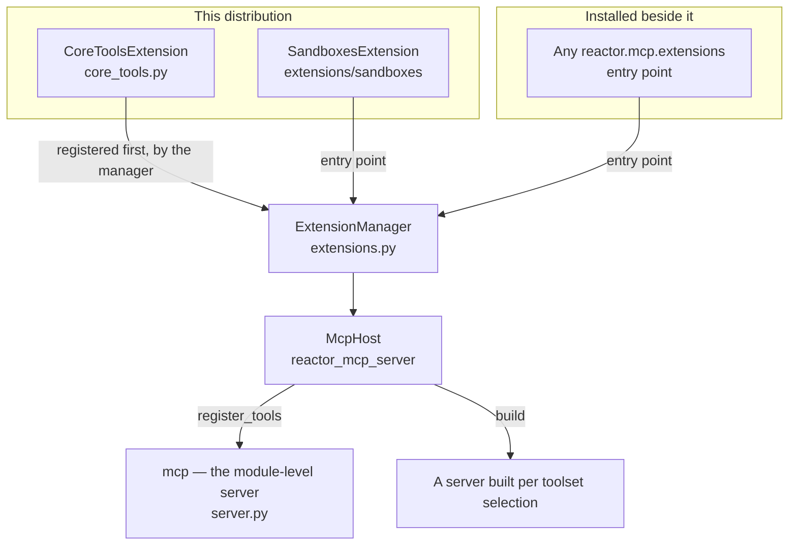
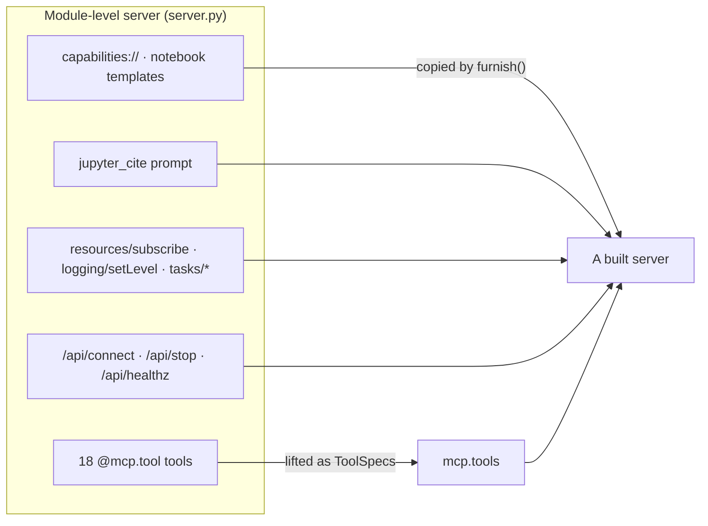
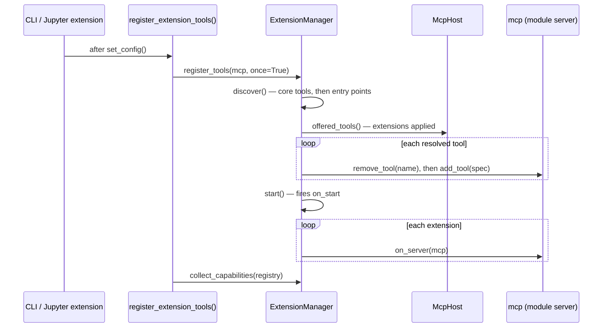
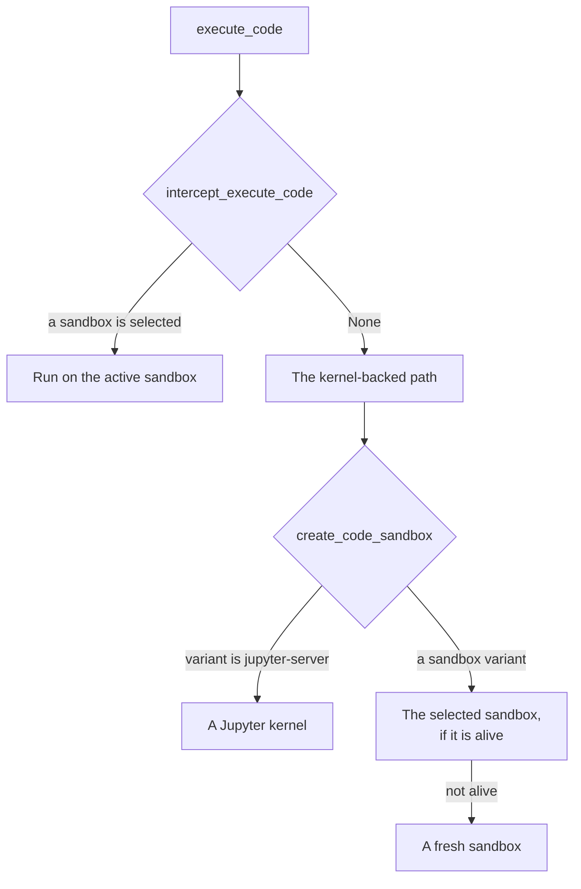

# Extensions

Everything this server serves arrives as an **extension**: the notebook tools
it ships, the sandbox lifecycle tools in `extensions/sandboxes`, and whatever
a deployment installs beside them. There is no privileged core registering
functions on a server object and a plugin mechanism bolted on beside it —
there is one mechanism, and the server uses it for itself.

That mechanism is
[`reactor_mcp_server`](https://github.com/datalayer/reactor), a foundation for
building MCP servers out of plugins. Three of its ideas decide the shape of
this page:

- **a tool is a contribution** — an extension *offers* a `ToolSpec`, and a
  host builds a server from what has been offered;
- **a contribution can be extended** — an extension may narrow, wrap or
  re-describe a tool *another* extension offered, by name;
- **the URL decides what is served** — tools belong to named toolsets, and a
  client picks them in the URL it connects to.

If you are writing an extension, [Operations → Extensions](../../operations/extensions/index.mdx)
is the guide. This page is how the ones in this repository are built.

## The shape of it



Two things are served, and they are the same tools either way:

- **the module-level server** (`mcp` in `server.py`) — what the CLI and the
  Jupyter Server extension run. `register_extension_tools()` puts every
  extension's tools on it;
- **a server built per toolset selection** — what a host serving toolsets by
  URL uses. The [Datalayer gateway](https://datalayer.ai) does this, so
  `/mcp?only=notebooks` is the notebook tools and nothing else.

## The server's own tools are an extension

The eighteen tools in `server.py` are written as they always were, with
`@mcp.tool` decorators on ordinary functions. What changed is that they are
also **offered** — by a built-in extension that reads them back off the server
the decorators registered them on:

```python
# jupyter_mcp_server/server.py — after the last decorator
SCAFFOLD_TOOLS: tuple[str, ...] = tuple(mcp._tool_manager._tools)
```

```python
# jupyter_mcp_server/core_tools.py
class CoreToolsExtension(McpExtension):
    def toolsets(self):
        return (Toolset(name=CORE_TOOLSET, description="Read, edit and run notebooks…"),)

    def tools(self):
        # lifted once, from SCAFFOLD_TOOLS, as ToolSpec values
```

The snapshot is taken at import, after the decorators and before any extension
registers, so it names what is *ours*: an extension's tools land on the same
server later, and lifting those back into contributions would offer each of
them twice. The lift happens once and is kept, for the same reason.

`CoreToolsExtension` is registered by `ExtensionManager.discover()` itself
rather than published on the entry-point group — it contributes what this
distribution ships, and a distribution cannot be missing itself.

### Why it matters

**An extension can narrow one of them.** Extending a tool is declared by name
against a contribution, and a decorated function is not a contribution. Before
this, an extension that addressed notebooks by uid rather than by path had to
reach into the running server's tool manager, take `use_notebook` off, and
register a replacement — and be loaded second, or the SDK would keep the
original. Now:

```python
def tool_extensions(self):
    return (("use_notebook", ToolExtension(wrap=by_name, description="…")),)
```

**A host can build a server that has them.** A server built from contributions
alone would carry every extension's tools and none of the notebook ones — the
notebook tools missing from the notebook server.

### A built server is not only its tools

Everything else the module-level server holds is registered on it at import
too: the `capabilities://` resource, the notebook resource templates, the
`jupyter_cite` prompt, the request handlers for `resources/subscribe`,
`logging/setLevel` and the task methods, and the management routes. None of it
is a contribution and some of it could not be one.

So a built server is **furnished** with them, on `on_server` — the hook for
what a tool list cannot express:

```python
def on_server(self, server) -> None:
    if server is mcp:
        return          # it already has its own
    furnish(server, mcp)
```

Leaving them out is worse than losing a tool. `initialize` computes
`resources.subscribe` from whether the handler is served, so a built server
without it tells every client this deployment does not do subscriptions — and
a client that reads the capability never asks.



## The extension manager

`ExtensionManager` is a thin layer over `McpHost`, which owns the reactor
platform: manifests, compatibility, activation events, enablement and disposal
are all its. What this class adds is the three hooks that are about *this*
server rather than about MCP.

| Method | What it does |
| --- | --- |
| `discover()` | Registers `CoreToolsExtension`, then every entry point on `reactor.mcp.extensions`, sorted by name. `JUPYTER_MCP_EXTENSIONS` narrows it to the names it lists. |
| `register(extension)` | Adds one to the platform. Any `McpExtension` is welcome, not only a `JupyterMCPExtension`. |
| `get(name)` | One registered extension by manifest name — `None` when it is not installed, which is an ordinary configuration. |
| `tools()` | Every tool on offer, extensions applied. |
| `register_tools(mcp, once=…)` | Puts them on a server, runs each extension's `on_server`, and starts the platform. |
| `collect_capabilities(registry)` | Asks each extension once what it adds. |
| `start()` / `stop()` | Starts the platform and fires `on_start` / `on_stop`. |
| `create_code_sandbox(...)` / `intercept_execute_code(...)` | The Jupyter hooks, dispatched to the extensions in turn. |

`register_tools` **replaces** a tool of the same name rather than adding a
second one: the SDK keeps the first registration and warns, so what the host
resolved — the tool with its extensions applied — would otherwise lose to the
unextended original, in a log nobody reads.

Registering is also what **starts** the extensions, so `on_start` fires where
the tools have just been put on a server and the command line has been read.
`register_extension_tools()` in `server.py` is the one entry point the CLI,
the Jupyter Server extension and a tool listing all reach:

```python
def register_extension_tools() -> None:
    extension_manager.register_tools(mcp, once=True)
    extension_manager.collect_capabilities(get_capabilities())
```



## The sandboxes extension

`extensions/sandboxes` is a distribution of its own —
[`jupyter-mcp-sandboxes`](https://pypi.org/project/jupyter-mcp-sandboxes/) —
that ships in this repository and installs separately. It is the worked
example of every hook this server offers.

```python
[project.entry-points."reactor.mcp.extensions"]
sandboxes = "jupyter_mcp_sandboxes:SandboxesExtension"
```

### What it declares

```python
class SandboxesExtension(JupyterMCPExtension):
    def __init__(self) -> None:
        self._manager = CodeSandboxManager()

    def manifest(self) -> PluginManifest:
        return PluginManifest(name="jupyter-mcp-sandboxes", version="0.1.0", …)

    def toolsets(self) -> tuple[Toolset, ...]:
        return (Toolset(name="sandboxes", description="Launch, use and terminate code sandboxes."),)
```

The toolset is named `sandboxes` — for its **subject**, not for the package.
A tool that names no toolset goes in one named after its plugin, and that is
what this used to do: a deployment adding its own sandbox tools under
`sandboxes` (a snapshot, an attached dataset, an environment catalogue) ended
up with the two split, and `?only=sandboxes` answered with tools that each
need a sandbox and no way to launch one. One name for one subject, and both
distributions declare it.

### The four tools

`tools()` returns them as `ToolSpec` values, each with the annotations a
client reads before calling it:

| Tool | Annotations say |
| --- | --- |
| `launch_sandbox` | destructive, **not** idempotent (each call costs another sandbox), open world (it runs arbitrary code) |
| `list_sandboxes` | read-only, idempotent, closed world |
| `use_sandbox` | destructive, idempotent — selecting the same one again leaves the same selection |
| `terminate_sandbox` | destructive, idempotent — terminating one already gone leaves it gone, which is what a client needs to know when a call times out |

The handlers are built inside `tools()` so they close over the extension's own
`CodeSandboxManager` and the `ServerContext`, and each wears the same
decorators a core tool does — `@structured(...)` for the result shape and
`@with_hooks(...)` so a call fires the [hook](../../operations/hooks/index.mdx)
pair like any other.

```python
def tools(self) -> list[ToolSpec]:
    manager = self._manager
    server_context = ServerContext.get_instance()

    @structured("sandbox.launch")
    @with_hooks("launch_sandbox")
    async def launch_sandbox(sandbox_name: str, variant: … = None, …) -> ToolAnswer:
        """Launch a sandbox for this session to run code in."""

    return [
        ToolSpec(name="launch_sandbox", handler=launch_sandbox,
                 annotations=LAUNCH_SANDBOX_ANNOTATIONS),
        …
    ]
```

Declared rather than registered: the host collects them, applies whatever
other extensions have contributed *to* them, and puts the result on a server.
`launch_sandbox` is the one downstream extensions narrow — which they now do
by name instead of by loading second.

### The two Jupyter hooks

This is the part that is about *this* server rather than about MCP, and it is
what makes a sandbox more than a set of tools: it becomes where code runs.

**`create_code_sandbox(config, logger)`** — asked when a notebook needs a
kernel. It answers `None` unless the configuration names a non-`jupyter-server`
variant; then it hands back the sandbox the caller selected with
`use_sandbox`, if there is a live one, and a fresh one otherwise. Reusing the
selection is what makes "assign the sandbox to the notebook" true — creating a
new one here would ignore the choice, pay for a second runtime, and run the
cell somewhere other than where the caller pointed. A selection that fails its
liveness check is not handed back: a dead client as the notebook's backend is
one the recovery path can never replace.

**`intercept_execute_code(code, timeout)`** — asked before the kernel-backed
path runs. It answers `None` when no sandbox is selected, and otherwise runs
the code on the active one.



### Lifecycle, and what it lends downstream

```python
    @property
    def sandboxes(self) -> CodeSandboxManager:
        """The sandboxes this extension launched, for extensions built on it."""
        return self._manager

    def on_stop(self) -> None:
        self._manager.terminate_all()
```

The property is public on purpose. A downstream extension adding a sandbox
tool — a snapshot, a mount — has to act on **this** registry, the one
`launch_sandbox` wrote to and `use_sandbox` points into; building its own
would be a second set of sandboxes with the same names, where "the active one"
means two different things depending on which tool you called. Reaching for
`_manager` instead works until this class holds its sandboxes some other way,
so it is reached through the manager:

```python
extension = get_extension_manager().get("jupyter-mcp-sandboxes")
registry = getattr(extension, "sandboxes", None)
```

## An extension somebody else ships

Nothing in this repository knows the difference between an extension shipped
alongside it and one installed from elsewhere — which is the point of the
entry-point group. The Datalayer gateway is the worked example of the far
side: it publishes three extensions on the same group and, between them,

- **offers** its own tools (spaces, the content catalogue, snapshots,
  benchmarks), declaring `sandboxes` so they join the ones above;
- **extends** three of this server's: `use_notebook` takes a name where the
  scaffold takes a path, `list_notebooks` answers with the caller's spaces,
  `launch_sandbox` takes an environment and a GPU rather than a provider;
- **acts on the built server** with `on_server`, taking off the three tools
  that assume a local Jupyter — `list_files`, `list_kernels`,
  `connect_to_jupyter` — because a deployment pointed at spaces has nothing
  for them to talk to.

None of that is in this repository, and none of it needs to be.

## Where the code is

| Path | What it holds |
| --- | --- |
| `jupyter_mcp_server/extensions.py` | `JupyterMCPExtension`, `ExtensionManager`, discovery |
| `jupyter_mcp_server/core_tools.py` | `CoreToolsExtension` and `furnish()` |
| `jupyter_mcp_server/server.py` | The tools themselves, `SCAFFOLD_TOOLS`, `register_extension_tools()` |
| `extensions/sandboxes/` | The `jupyter-mcp-sandboxes` distribution |

## See also

- [Extensions](../../operations/extensions/index.mdx) — writing one.
- [Capabilities](../../operations/capabilities/index.mdx) — declaring what an
  extension lets the server do.
- [Hooks](../../operations/hooks/index.mdx) — observing calls rather than
  changing them.
- [Code sandboxes](../../code-sandboxes/index.mdx) — the engines behind the
  sandbox variants.
