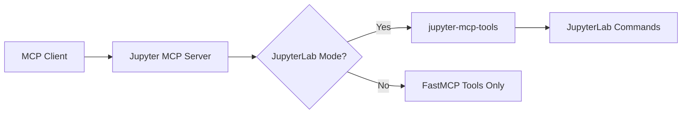

# Additional Tools

In JupyterLab mode, Jupyter MCP Server integrates with [jupyter-mcp-tools](https://github.com/datalayer/jupyter-mcp-tools) to expose additional JupyterLab-specific commands as MCP tools.

## Dependency on jupyter-mcp-tools

When running in JupyterLab mode (see [Configuration](/reference/configuration)), Jupyter MCP Server depends on **jupyter-mcp-tools** to provide enhanced UI integration capabilities. This extension enables the use of JupyterLab commands as MCP tools.

### Installation

The `jupyter-mcp-tools` package must be installed in your JupyterLab environment:

```bash
pip install jupyter-mcp-tools>=0.1.4
```

### How It Works

1. **JupyterLab Mode Detection**: When Jupyter MCP Server detects it's running in JupyterLab mode, it queries `jupyter-mcp-tools` for available commands
2. **Allowed Tools Filtering**: Only specific tools from `jupyter-mcp-tools` are exposed to MCP clients (see [Allowed Tools](#allowed-tools) below)
3. **Command Routing**: When an MCP client calls one of these tools, the request is routed to `jupyter-mcp-tools` which executes the corresponding JupyterLab command

## Allowed Tools

The following tools from `jupyter-mcp-tools` are enabled by default in Jupyter MCP Server:

| Tool Name | Description |
|-----------|-------------|
| `notebook_run-all-cells` | Execute all cells in the current notebook sequentially |
| `notebook_get-selected-cell` | Get information about the currently selected cell |

:::info Configuring Allowed Tools
The list of allowed `jupyter-mcp-tools` is now configurable! 

The complete **list of available tools** can be found in the **[jupyter-mcp-tools README](https://github.com/datalayer/jupyter-mcp-tools/blob/main/README.md#available-tools)**.
:::

You can specify which tools to enable using:

**When running jupyter-mcp-server as a Jupyter Server Extension:**
```bash
# Using environment variable
ALLOWED_JUPYTER_MCP_TOOLS="notebook_run-all-cells,notebook_get-selected-cell,notebook_append-execute" jupyter lab --port 4040 --IdentityProvider.token MY_TOKEN

# Using command-line configuration
jupyter lab --port 4040 --IdentityProvider.token MY_TOKEN --JupyterMCPServerExtensionApp.allowed_jupyter_mcp_tools="notebook_run-all-cells,notebook_get-selected-cell,notebook_append-execute"
```

**When running jupyter-mcp-server standalone:**
```bash
# CLI Option
jupyter-mcp-server --allowed-jupyter-mcp-tools "notebook_run-all-cells,notebook_get-selected-cell,notebook_append-execute"

# Environment Variable
export ALLOWED_JUPYTER_MCP_TOOLS="notebook_run-all-cells,notebook_get-selected-cell,notebook_append-execute"
jupyter-mcp-server
```

For developers who want to modify the default list programmatically, you can still update the `allowed_jupyter_mcp_tools` configuration in:
- [`jupyter_mcp_server/server.py`](https://github.com/datalayer/jupyter-mcp-server/blob/main/jupyter_mcp_server/server.py) - for standalone/STDIO mode
- [`jupyter_mcp_server/jupyter_extension/handlers.py`](https://github.com/datalayer/jupyter-mcp-server/blob/main/jupyter_mcp_server/jupyter_extension/handlers.py) - for Jupyter server extension mode

## Architecture



When JupyterLab mode is enabled:
- Jupyter MCP Server queries `jupyter-mcp-tools` for available tools
- Only tools in the `allowed_jupyter_mcp_tools` configuration are exposed to MCP clients
- Tool execution is routed through `jupyter-mcp-tools` which communicates with the JupyterLab frontend via WebSocket
