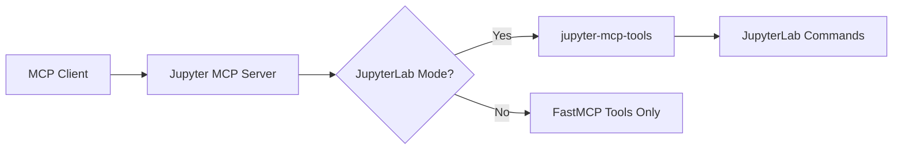

# Additional Tools

In JupyterLab mode, Jupyter MCP Server integrates with [jupyter-mcp-tools](https://github.com/datalayer/jupyter-mcp-tools) to expose additional JupyterLab-specific commands as MCP tools.

## Dependency on jupyter-mcp-tools

When running in JupyterLab mode (see [Configuration](/reference/configuration)), Jupyter MCP Server depends on **jupyter-mcp-tools** to provide enhanced UI integration capabilities. This extension enables the use of JupyterLab commands as MCP tools.

### Installation

The `jupyter-mcp-tools` package must be installed in your JupyterLab environment:

```bash
pip install jupyter-mcp-tools>=0.1.4
```

### How It Works

1. **JupyterLab Mode Detection**: When Jupyter MCP Server detects it's running in JupyterLab mode, it queries `jupyter-mcp-tools` for available commands
2. **Allowed Tools Filtering**: Only specific tools from `jupyter-mcp-tools` are exposed to MCP clients (see [Allowed Tools](#allowed-tools) below)
3. **Command Routing**: When an MCP client calls one of these tools, the request is routed to `jupyter-mcp-tools` which executes the corresponding JupyterLab command

## Allowed Tools

The following tools from `jupyter-mcp-tools` are currently allowed and exposed by Jupyter MCP Server:

| Tool Name | Description |
|-----------|-------------|
| `notebook_run-all-cells` | Execute all cells in the current notebook sequentially |

:::info Adding New Tools
To add additional `jupyter-mcp-tools` commands, developers need to add them to the `allowed_jupyter_tools` list in both:
- [`jupyter_mcp_server/server.py`](https://github.com/datalayer/jupyter-mcp-server/blob/main/jupyter_mcp_server/server.py) - for standalone/STDIO mode
- [`jupyter_mcp_server/jupyter_extension/handlers.py`](https://github.com/datalayer/jupyter-mcp-server/blob/main/jupyter_mcp_server/jupyter_extension/handlers.py) - for Jupyter server extension mode
:::

## Available Commands from jupyter-mcp-tools

The `jupyter-mcp-tools` extension provides several custom JupyterLab commands. Here are some notable ones that could be added to `allowed_jupyter_tools`:

### notebook:append-execute

Appends a new cell at the end of the current notebook with the given source code and optionally executes it.

**Parameters:**
- `source` (string, required): The source code to insert in the cell
- `type` (string, optional): The cell type - `'code'`, `'markdown'`, or `'raw'` (default: `'code'`)

### notebook:get-selected-cell

Gets information about the currently selected/active cell in the notebook without executing it.

**Parameters:** None

**Returns:** Cell type, index, source, metadata, and execution count.

## Architecture



When JupyterLab mode is enabled:
- Jupyter MCP Server queries `jupyter-mcp-tools` for available tools
- Only tools in the `allowed_jupyter_tools` list are exposed to MCP clients
- Tool execution is routed through `jupyter-mcp-tools` which communicates with the JupyterLab frontend via WebSocket
